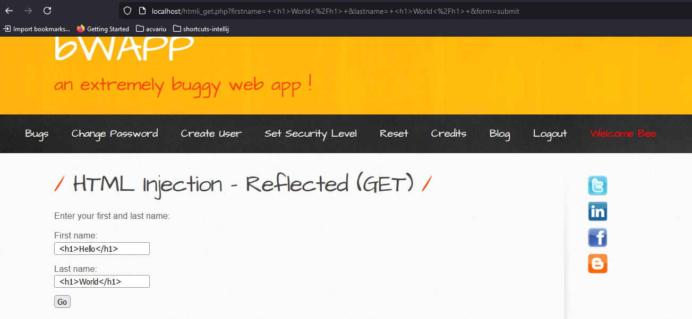
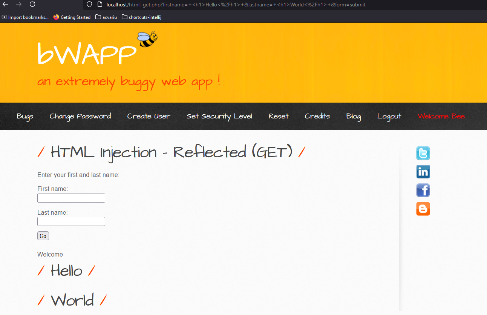
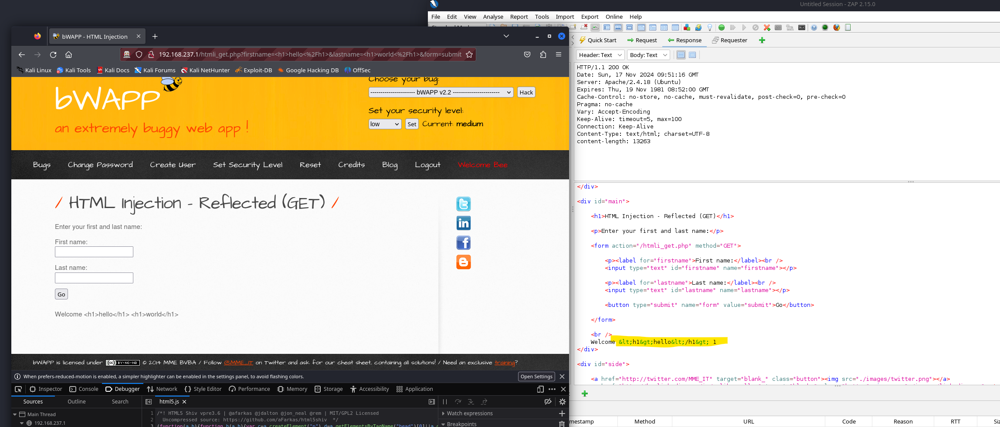
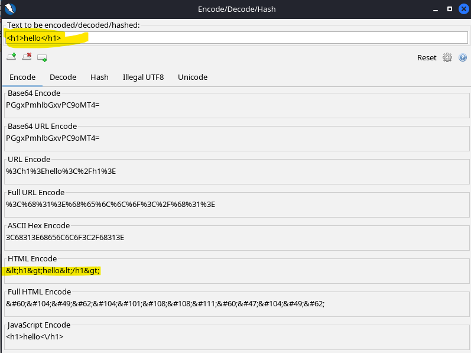
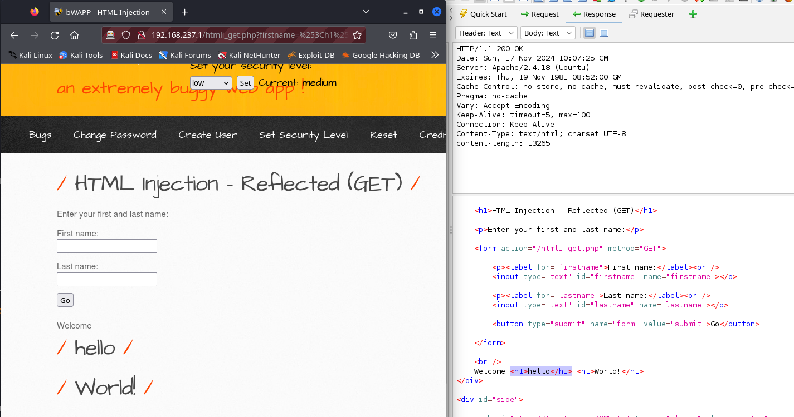

### Low

This page is also vulnerable to XSS.

### Medium

We can see that our input is HTML encoded, preventing its execution.

If we URL encode the input it will work.

%3Ch1%3Ehello%3C%2Fh1%3E

### High

| input                      | output                                     |
| -------------------------- | ------------------------------------------ |
| <h1>Hello</h1>             | &lt;h1&gt;Hello&lt;/h1&gt;                 |
| &lt;h1&gt;Hello&lt;/h1&gt; | &amp;lt;h1&amp;gt;Hello&amp;lt;/h1&amp;gt; |
| %3Ch1%3Ehello%3C%2Fh1%3E   | %3Ch1%3Ehello%3C%2Fh1%3E                   |

It may use htmlspecialchars.