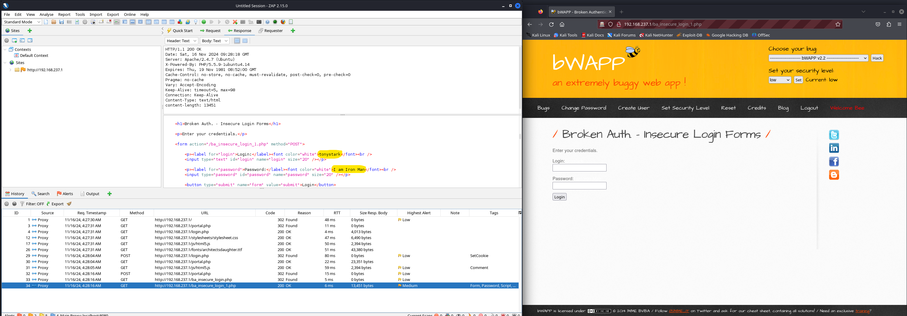
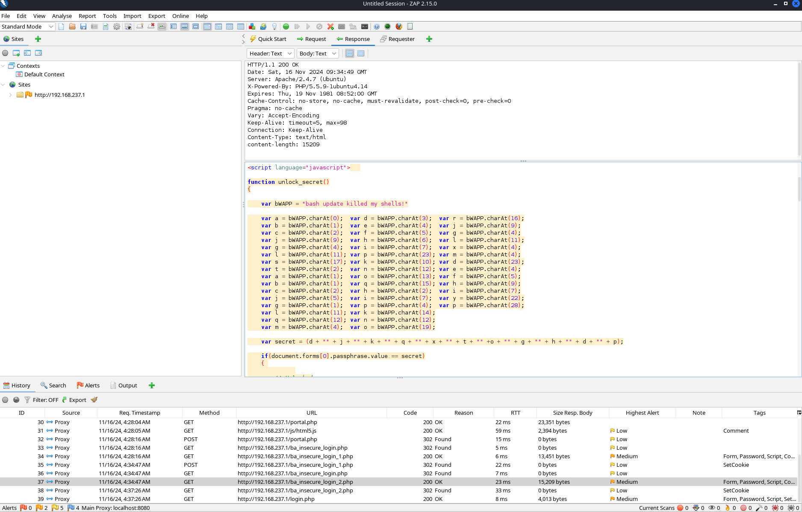
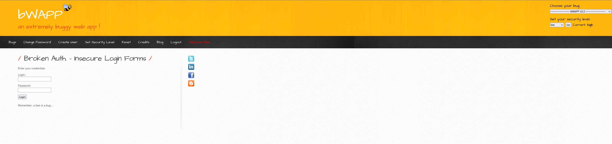

### Low

The username and password are provided in the html page.

username: tonystark

password: I am Iron Man

### Medium

Website loads ba_insecure_login_2.php. This file contains the above mentioned function. To determine the password you need to manually evaluate secret variable.

BASH UPDATE KILLED MY SHELLS!

We know that the variables composing the secret all evaluate to characters from the above mentioned string. Using their index with the table below we find that the secret is hulk_smash!

| B   | A   | S   | H   |     | U   | P   | D   | A   | T   | E   |     | K   | I   | L   | L   | E   | D   |     | M   | Y   |     | S   | H   | E   | L   | L   | S   | !   |
| --- | --- | --- | --- | --- | --- | --- | --- | --- | --- | --- | --- | --- | --- | --- | --- | --- | --- | --- | --- | --- | --- | --- | --- | --- | --- | --- | --- | --- |
| 0   | 1   | 2   | 3   | 4   | 5   | 6   | 7   | 8   | 9   | 10  | 11  | 12  | 13  | 14  | 15  | 16  | 17  | 18  | 19  | 20  | 21  | 22  | 23  | 24  | 25  | 26  | 27  | 28  |

### High

The username and password are in the hint. If you don't use a new browser session the browser may auto-complete the username and password.
